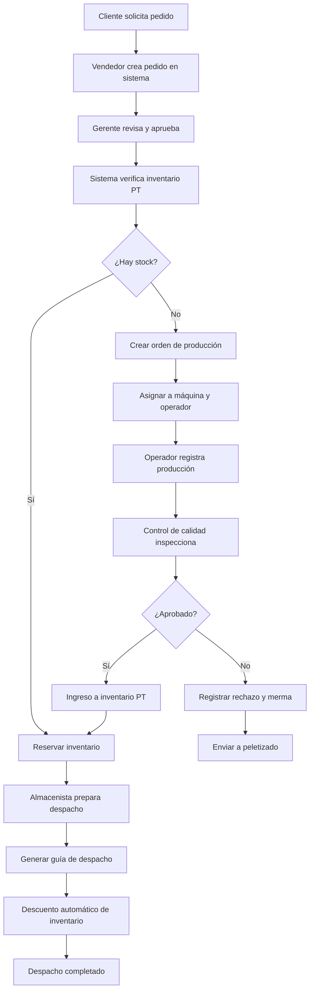
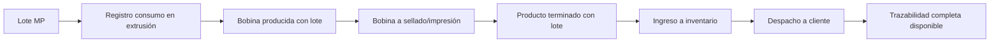
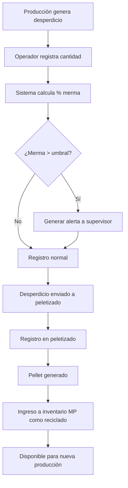

# Sistema ERP/MRP para Fabricación de Bolsas y Bobinas de Polietileno

## 📋 Información del Proyecto

**Tipo:** Sistema Web y Mobile Responsivo  
**Industria:** Manufactura de Polietileno  
**Usuarios Concurrentes:** ~15 usuarios  
**Máquinas en Planta:** ~10 máquinas (2 extrusoras, 4 selladoras, 2 impresoras, 1 refiladora, 1 molino)  
**Ubicación:** 2 galpones de producción

---

## 🎯 Objetivos del Sistema

1. **Gestión Integral de Producción:** Control completo desde pedido hasta despacho
2. **Trazabilidad Total:** Seguimiento de materia prima a producto terminado
3. **Optimización de Recursos:** Cálculo automático de OEE, rendimiento y merma
4. **Toma de Decisiones:** Dashboard con KPIs industriales en tiempo real
5. **Control de Calidad:** Registro y seguimiento de parámetros de calidad
6. **Gestión de Inventarios:** Control automático de materia prima y producto terminado
7. **Reportería Avanzada:** Exportación de datos en PDF y Excel

---

## 🏗️ Arquitectura del Sistema

### Stack Tecnológico

#### Frontend
- **Framework:** React 18+ con Vite
- **Routing:** React Router v6
- **Estilos:** TailwindCSS 3+
- **Estado Global:** Redux Toolkit (para estado complejo) + Context API (para temas/auth)
- **Gráficos:** Recharts (principal) + Chart.js (gráficos especializados)
- **Drag & Drop:** react-dnd o @dnd-kit
- **Tablas:** TanStack Table (React Table v8)
- **Formularios:** React Hook Form + Zod (validación)
- **Fechas:** date-fns
- **Exportación:** jsPDF + xlsx
- **Notificaciones:** react-hot-toast
- **HTTP Client:** Axios

#### Backend
- **Runtime:** Node.js 18+ LTS
- **Framework:** Express.js 4+
- **Base de Datos:** PostgreSQL 15+
- **ORM:** Prisma (recomendado) o Sequelize
- **Autenticación:** JWT (jsonwebtoken) + bcrypt
- **Validación:** Joi o Zod
- **Documentación API:** Swagger/OpenAPI
- **Logging:** Winston
- **Variables de Entorno:** dotenv
- **CORS:** cors middleware
- **Rate Limiting:** express-rate-limit
- **Generación PDF:** PDFKit o Puppeteer
- **Generación Excel:** exceljs

#### DevOps & Deployment
- **Contenedores:** Docker + Docker Compose
- **Proxy Reverso:** Nginx
- **SSL:** Let's Encrypt (Certbot)
- **CI/CD:** GitHub Actions o GitLab CI
- **Monitoreo:** PM2 (Node.js) + PostgreSQL logs
- **Backup:** pg_dump automatizado

---

## 📊 Modelo de Datos

### Diagrama Entidad-Relación

```mermaid
erDiagram
    USERS ||--o{ PRODUCTION_ORDERS : creates
    USERS ||--o{ QUALITY_CONTROLS : performs
    USERS {
        int id PK
        string username UK
        string email UK
        string password_hash
        string full_name
        enum role
        boolean is_active
        timestamp created_at
        timestamp updated_at
    }

    ROLES ||--o{ USERS : has
    ROLES {
        int id PK
        string name UK
        json permissions
        string description
    }

    CUSTOMERS ||--o{ ORDERS : places
    CUSTOMERS {
        int id PK
        string code UK
        string business_name
        string tax_id
        string contact_name
        string phone
        string email
        string address
        boolean is_active
        timestamp created_at
    }

    PRODUCTS ||--o{ ORDER_ITEMS : contains
    PRODUCTS ||--o{ PRODUCT_MACHINE_PARAMS : has
    PRODUCTS {
        int id PK
        string code UK
        string name
        decimal width_cm
        decimal length_cm
        decimal caliber_microns
        boolean has_gusset
        decimal gusset_width_cm
        boolean has_perforation
        boolean has_valve
        decimal valve_width_cm
        decimal max_reel_weight_kg
        boolean is_heat_shrinkable
        boolean requires_trimming
        decimal bag_weight_grams
        string material_type
        string color
        boolean is_active
        timestamp created_at
    }

    MACHINES ||--o{ PRODUCTION_RECORDS : produces_on
    MACHINES ||--o{ MACHINE_STOPS : has
    MACHINES ||--o{ PLANT_MAP_POSITIONS : located_at
    MACHINES {
        int id PK
        string code UK
        string name
        enum type
        enum area
        decimal standard_speed
        string warehouse_location
        json technical_specs
        boolean is_active
        timestamp created_at
    }

    PRODUCT_MACHINE_PARAMS {
        int id PK
        int product_id FK
        int machine_id FK
        enum area
        json parameters
        timestamp created_at
    }

    ORDERS ||--o{ ORDER_ITEMS : contains
    ORDERS ||--o{ PRODUCTION_ORDERS : generates
    ORDERS {
        int id PK
        string order_number UK
        int customer_id FK
        date order_date
        date delivery_date
        enum status
        decimal total_amount
        text notes
        int created_by FK
        timestamp created_at
    }

    ORDER_ITEMS {
        int id PK
        int order_id FK
        int product_id FK
        decimal quantity_units
        decimal quantity_kg
        decimal unit_price
        decimal subtotal
        text specifications
    }

    PRODUCTION_ORDERS ||--o{ PRODUCTION_RECORDS : has
    PRODUCTION_ORDERS {
        int id PK
        string po_number UK
        int order_id FK
        int product_id FK
        decimal planned_quantity_kg
        date start_date
        date end_date
        enum status
        enum priority
        int created_by FK
        timestamp created_at
    }

    PRODUCTION_RECORDS ||--o{ QUALITY_CONTROLS : has
    PRODUCTION_RECORDS {
        int id PK
        int production_order_id FK
        int machine_id FK
        enum area
        date production_date
        time shift_start
        time shift_end
        decimal produced_quantity_kg
        decimal waste_quantity_kg
        decimal waste_percentage
        decimal operation_time_hours
        decimal downtime_hours
        decimal machine_efficiency
        decimal oee
        json machine_parameters
        int operator_id FK
        text notes
        timestamp created_at
    }

    RAW_MATERIALS ||--o{ RAW_MATERIAL_INVENTORY : tracks
    RAW_MATERIALS ||--o{ MATERIAL_CONSUMPTION : consumes
    RAW_MATERIALS {
        int id PK
        string code UK
        string name
        enum type
        string supplier
        decimal unit_cost
        string unit_measure
        decimal min_stock
        boolean is_active
        timestamp created_at
    }

    RAW_MATERIAL_INVENTORY {
        int id PK
        int material_id FK
        decimal quantity
        string batch_number
        date entry_date
        date expiry_date
        string warehouse_location
        enum status
        timestamp updated_at
    }

    MATERIAL_CONSUMPTION {
        int id PK
        int production_record_id FK
        int material_id FK
        decimal quantity_consumed
        decimal theoretical_consumption
        decimal variance_percentage
        timestamp created_at
    }

    FINISHED_GOODS_INVENTORY ||--o{ DISPATCH_ITEMS : dispatches
    FINISHED_GOODS_INVENTORY {
        int id PK
        int product_id FK
        int production_record_id FK
        string batch_number UK
        decimal quantity_kg
        decimal quantity_units
        integer reels_count
        integer bags_per_reel
        string warehouse_location
        enum status
        date production_date
        timestamp created_at
    }

    PELLETIZING_RECORDS {
        int id PK
        date pelletizing_date
        decimal input_waste_kg
        decimal output_pellet_kg
        decimal yield_percentage
        int operator_id FK
        text notes
        timestamp created_at
    }

    QUALITY_CONTROLS {
        int id PK
        int production_record_id FK
        int product_id FK
        date inspection_date
        enum inspection_type
        json test_results
        enum result_status
        text observations
        int inspector_id FK
        timestamp created_at
    }

    MACHINE_STOPS {
        int id PK
        int machine_id FK
        datetime stop_start
        datetime stop_end
        decimal duration_minutes
        enum stop_type
        enum stop_reason
        text description
        int reported_by FK
        timestamp created_at
    }

    DISPATCHES ||--o{ DISPATCH_ITEMS : contains
    DISPATCHES {
        int id PK
        string dispatch_number UK
        int order_id FK
        int customer_id FK
        date dispatch_date
        string vehicle_plate
        string driver_name
        enum status
        int created_by FK
        timestamp created_at
    }

    DISPATCH_ITEMS {
        int id PK
        int dispatch_id FK
        int finished_goods_id FK
        decimal quantity_kg
        decimal quantity_units
        string batch_number
    }

    TASKS {
        int id PK
        string title
        text description
        enum priority
        enum status
        date due_date
        int assigned_to FK
        int created_by FK
        timestamp created_at
        timestamp completed_at
    }

    PLANT_MAP_POSITIONS {
        int id PK
        int machine_id FK
        enum warehouse
        decimal position_x
        decimal position_y
        decimal width
        decimal height
        timestamp updated_at
    }

    TRAINING_MODULES {
        int id PK
        string title
        text content
        enum module_type
        string file_url
        integer order_index
        boolean is_active
        timestamp created_at
    }

    AUDIT_LOGS {
        int id PK
        int user_id FK
        string action
        string table_name
        integer record_id
        json old_values
        json new_values
        string ip_address
        timestamp created_at
    }
```



---

## 🗂️ Estructura de Carpetas

### Frontend Structure

```
erp-polietileno-frontend/
├── public/
│   ├── favicon.ico
│   └── logo.png
├── src/
│   ├── api/
│   │   ├── axios.config.js
│   │   ├── endpoints.js
│   │   └── services/
│   │       ├── authService.js
│   │       ├── customersService.js
│   │       ├── productsService.js
│   │       ├── ordersService.js
│   │       ├── productionService.js
│   │       ├── inventoryService.js
│   │       ├── qualityService.js
│   │       ├── machinesService.js
│   │       ├── reportsService.js
│   │       └── dashboardService.js
│   ├── assets/
│   │   ├── images/
│   │   ├── icons/
│   │   └── fonts/
│   ├── components/
│   │   ├── common/
│   │   │   ├── Button.jsx
│   │   │   ├── Input.jsx
│   │   │   ├── Select.jsx
│   │   │   ├── Modal.jsx
│   │   │   ├── Table.jsx
│   │   │   ├── Pagination.jsx
│   │   │   ├── SearchBar.jsx
│   │   │   ├── DateRangePicker.jsx
│   │   │   ├── ExportButton.jsx
│   │   │   ├── LoadingSpinner.jsx
│   │   │   └── Card.jsx
│   │   ├── layout/
│   │   │   ├── Navbar.jsx
│   │   │   ├── Sidebar.jsx
│   │   │   ├── Footer.jsx
│   │   │   └── MainLayout.jsx
│   │   ├── dashboard/
│   │   │   ├── KPICard.jsx
│   │   │   ├── ProductionChart.jsx
│   │   │   ├── OEEGauge.jsx
│   │   │   ├── MachineStatusGrid.jsx
│   │   │   └── RecentAlerts.jsx
│   │   ├── production/
│   │   │   ├── ProductionForm.jsx
│   │   │   ├── ProductionTable.jsx
│   │   │   ├── MachineParametersPanel.jsx
│   │   │   └── ShiftSummary.jsx
│   │   ├── quality/
│   │   │   ├── QualityTestForm.jsx
│   │   │   ├── ControlChart.jsx
│   │   │   ├── ParetoChart.jsx
│   │   │   └── IshikawaDiagram.jsx
│   │   ├── inventory/
│   │   │   ├── InventoryTable.jsx
│   │   │   ├── StockAlerts.jsx
│   │   │   └── WarehouseMap.jsx
│   │   ├── orders/
│   │   │   ├── OrderForm.jsx
│   │   │   ├── OrdersList.jsx
│   │   │   └── OrderDetails.jsx
│   │   ├── reports/
│   │   │   ├── ReportFilters.jsx
│   │   │   ├── GanttChart.jsx
│   │   │   └── StatisticalCharts.jsx
│   │   └── plant-map/
│   │       ├── PlantMapCanvas.jsx
│   │       ├── MachineIcon.jsx
│   │       └── DraggableMachine.jsx
│   ├── contexts/
│   │   ├── AuthContext.jsx
│   │   └── ThemeContext.jsx
│   ├── hooks/
│   │   ├── useAuth.js
│   │   ├── useTable.js
│   │   ├── useExport.js
│   │   ├── useDebounce.js
│   │   └── useWebSocket.js
│   ├── pages/
│   │   ├── auth/
│   │   │   ├── Login.jsx
│   │   │   └── ForgotPassword.jsx
│   │   ├── dashboard/
│   │   │   └── Dashboard.jsx
│   │   ├── customers/
│   │   │   ├── CustomersList.jsx
│   │   │   └── CustomerForm.jsx
│   │   ├── products/
│   │   │   ├── ProductsList.jsx
│   │   │   └── ProductForm.jsx
│   │   ├── machines/
│   │   │   ├── MachinesList.jsx
│   │   │   ├── MachineForm.jsx
│   │   │   └── MachineParameters.jsx
│   │   ├── orders/
│   │   │   ├── OrdersList.jsx
│   │   │   ├── OrderForm.jsx
│   │   │   └── OrderDetails.jsx
│   │   ├── production/
│   │   │   ├── ProductionOrders.jsx
│   │   │   ├── ExtrusionProduction.jsx
│   │   │   ├── SealingProduction.jsx
│   │   │   ├── PrintingProduction.jsx
│   │   │   ├── TrimmingProduction.jsx
│   │   │   └── PelletizingRecords.jsx
│   │   ├── inventory/
│   │   │   ├── RawMaterialInventory.jsx
│   │   │   ├── FinishedGoodsInventory.jsx
│   │   │   └── MaterialConsumption.jsx
│   │   ├── quality/
│   │   │   ├── QualityControls.jsx
│   │   │   └── QualityReports.jsx
│   │   ├── dispatches/
│   │   │   ├── DispatchesList.jsx
│   │   │   └── DispatchForm.jsx
│   │   ├── maintenance/
│   │   │   ├── MachineStops.jsx
│   │   │   └── MaintenanceSchedule.jsx
│   │   ├── tasks/
│   │   │   └── TasksManager.jsx
│   │   ├── reports/
│   │   │   ├── ProductionReports.jsx
│   │   │   ├── InventoryReports.jsx
│   │   │   ├── QualityReports.jsx
│   │   │   └── FinancialReports.jsx
│   │   ├── statistics/
│   │   │   ├── GanttView.jsx
│   │   │   ├── ParetoAnalysis.jsx
│   │   │   ├── IshikawaEditor.jsx
│   │   │   └── ControlCharts.jsx
│   │   ├── plant-map/
│   │   │   └── PlantMapEditor.jsx
│   │   ├── training/
│   │   │   ├── TrainingModules.jsx
│   │   │   └── ProcessFlowcharts.jsx
│   │   └── settings/
│   │       ├── UserManagement.jsx
│   │       ├── RolesPermissions.jsx
│   │       └── SystemSettings.jsx
│   ├── redux/
│   │   ├── store.js
│   │   └── slices/
│   │       ├── authSlice.js
│   │       ├── productionSlice.js
│   │       ├── inventorySlice.js
│   │       └── notificationsSlice.js
│   ├── routes/
│   │   ├── AppRoutes.jsx
│   │   ├── PrivateRoute.jsx
│   │   └── RoleBasedRoute.jsx
│   ├── utils/
│   │   ├── calculations.js
│   │   ├── formatters.js
│   │   ├── validators.js
│   │   ├── exportPDF.js
│   │   ├── exportExcel.js
│   │   └── constants.js
│   ├── styles/
│   │   ├── index.css
│   │   └── tailwind.config.js
│   ├── App.jsx
│   └── main.jsx
├── .env.example
├── .gitignore
├── package.json
├── vite.config.js
├── tailwind.config.js
├── postcss.config.js
└── README.md
```

### Backend Structure

```
erp-polietileno-backend/
├── src/
│   ├── config/
│   │   ├── database.js
│   │   ├── jwt.js
│   │   └── constants.js
│   ├── controllers/
│   │   ├── authController.js
│   │   ├── usersController.js
│   │   ├── customersController.js
│   │   ├── productsController.js
│   │   ├── machinesController.js
│   │   ├── ordersController.js
│   │   ├── productionOrdersController.js
│   │   ├── productionRecordsController.js
│   │   ├── rawMaterialsController.js
│   │   ├── inventoryController.js
│   │   ├── qualityController.js
│   │   ├── dispatchesController.js
│   │   ├── pelletizingController.js
│   │   ├── machineStopsController.js
│   │   ├── tasksController.js
│   │   ├── reportsController.js
│   │   ├── dashboardController.js
│   │   └── plantMapController.js
│   ├── middleware/
│   │   ├── authMiddleware.js
│   │   ├── roleMiddleware.js
│   │   ├── validationMiddleware.js
│   │   ├── errorHandler.js
│   │   ├── rateLimiter.js
│   │   └── auditLogger.js
│   ├── models/
│   │   ├── User.js
│   │   ├── Role.js
│   │   ├── Customer.js
│   │   ├── Product.js
│   │   ├── Machine.js
│   │   ├── ProductMachineParam.js
│   │   ├── Order.js
│   │   ├── OrderItem.js
│   │   ├── ProductionOrder.js
│   │   ├── ProductionRecord.js
│   │   ├── RawMaterial.js
│   │   ├── RawMaterialInventory.js
│   │   ├── MaterialConsumption.js
│   │   ├── FinishedGoodsInventory.js
│   │   ├── QualityControl.js
│   │   ├── Dispatch.js
│   │   ├── DispatchItem.js
│   │   ├── PelletizingRecord.js
│   │   ├── MachineStop.js
│   │   ├── Task.js
│   │   ├── PlantMapPosition.js
│   │   ├── TrainingModule.js
│   │   ├── AuditLog.js
│   │   └── index.js
│   ├── routes/
│   │   ├── authRoutes.js
│   │   ├── usersRoutes.js
│   │   ├── customersRoutes.js
│   │   ├── productsRoutes.js
│   │   ├── machinesRoutes.js
│   │   ├── ordersRoutes.js
│   │   ├── productionRoutes.js
│   │   ├── inventoryRoutes.js
│   │   ├── qualityRoutes.js
│   │   ├── dispatchesRoutes.js
│   │   ├── pelletizingRoutes.js
│   │   ├── machineStopsRoutes.js
│   │   ├── tasksRoutes.js
│   │   ├── reportsRoutes.js
│   │   ├── dashboardRoutes.js
│   │   ├── plantMapRoutes.js
│   │   └── index.js
│   ├── services/
│   │   ├── authService.js
│   │   ├── calculationService.js
│   │   ├── inventoryService.js
│   │   ├── traceabilityService.js
│   │   ├── reportService.js
│   │   ├── pdfService.js
│   │   ├── excelService.js
│   │   └── notificationService.js
│   ├── utils/
│   │   ├── calculations.js
│   │   ├── validators.js
│   │   ├── formatters.js
│   │   ├── logger.js
│   │   └── helpers.js
│   ├── validators/
│   │   ├── authValidators.js
│   │   ├── customerValidators.js
│   │   ├── productValidators.js
│   │   ├── orderValidators.js
│   │   ├── productionValidators.js
│   │   └── inventoryValidators.js
│   ├── database/
│   │   ├── migrations/
│   │   ├── seeders/
│   │   └── schema.sql
│   └── app.js
├── tests/
│   ├── unit/
│   ├── integration/
│   └── e2e/
├── .env.example
├── .gitignore
├── package.json
├── server.js
├── Dockerfile
├── docker-compose.yml
└── README.md
```

---

## 🔐 Sistema de Autenticación y Roles

### Roles del Sistema

1. **Super Admin**
   - Acceso total al sistema
   - Gestión de usuarios y roles
   - Configuración del sistema

2. **Gerente de Producción**
   - Visualización de todos los módulos
   - Creación de órdenes de producción
   - Aprobación de pedidos
   - Reportes completos

3. **Supervisor de Área**
   - Gestión de producción en su área
   - Registro de paradas de máquina
   - Control de calidad
   - Reportes de su área

4. **Operador de Máquina**
   - Registro de producción
   - Consulta de parámetros de máquina
   - Registro de paradas
   - Consulta de órdenes asignadas

5. **Almacenista**
   - Gestión de inventarios
   - Registro de entradas/salidas
   - Despachos
   - Reportes de inventario

6. **Vendedor**
   - Gestión de clientes
   - Creación de pedidos
   - Consulta de inventario
   - Seguimiento de despachos

7. **Control de Calidad**
   - Registro de pruebas de calidad
   - Aprobación/rechazo de lotes
   - Reportes de calidad
   - Análisis estadístico

### Matriz de Permisos

| Módulo | Super Admin | Gerente | Supervisor | Operador | Almacenista | Vendedor | Calidad |
|--------|-------------|---------|------------|----------|-------------|----------|---------|
| Dashboard | ✓ | ✓ | ✓ | ✓ | ✓ | ✓ | ✓ |
| Clientes | ✓ | ✓ | - | - | - | ✓ | - |
| Productos | ✓ | ✓ | ✓ | R | - | R | R |
| Máquinas | ✓ | ✓ | ✓ | R | - | - | - |
| Pedidos | ✓ | ✓ | R | - | - | ✓ | - |
| Órdenes Producción | ✓ | ✓ | ✓ | R | - | R | R |
| Producción | ✓ | ✓ | ✓ | ✓ | - | - | - |
| Inventario MP | ✓ | ✓ | R | - | ✓ | - | - |
| Inventario PT | ✓ | ✓ | R | - | ✓ | R | - |
| Control Calidad | ✓ | ✓ | ✓ | - | - | - | ✓ |
| Despachos | ✓ | ✓ | R | - | ✓ | ✓ | - |
| Paradas Máquina | ✓ | ✓ | ✓ | ✓ | - | - | - |
| Reportes | ✓ | ✓ | ✓ | R | ✓ | ✓ | ✓ |
| Configuración | ✓ | - | - | - | - | - | - |

**Leyenda:** ✓ = Acceso completo, R = Solo lectura, - = Sin acceso

---

## 📡 API REST Endpoints

### Authentication
```
POST   /api/auth/login
POST   /api/auth/logout
POST   /api/auth/refresh-token
POST   /api/auth/forgot-password
POST   /api/auth/reset-password
GET    /api/auth/me
```

### Users
```
GET    /api/users
GET    /api/users/:id
POST   /api/users
PUT    /api/users/:id
DELETE /api/users/:id
PATCH  /api/users/:id/status
```

### Customers
```
GET    /api/customers
GET    /api/customers/:id
POST   /api/customers
PUT    /api/customers/:id
DELETE /api/customers/:id
GET    /api/customers/:id/orders
```

### Products
```
GET    /api/products
GET    /api/products/:id
POST   /api/products
PUT    /api/products/:id
DELETE /api/products/:id
GET    /api/products/:id/machine-params
POST   /api/products/:id/machine-params
```

### Machines
```
GET    /api/machines
GET    /api/machines/:id
POST   /api/machines
PUT    /api/machines/:id
DELETE /api/machines/:id
GET    /api/machines/:id/current-status
GET    /api/machines/:id/production-history
```

### Orders
```
GET    /api/orders
GET    /api/orders/:id
POST   /api/orders
PUT    /api/orders/:id
DELETE /api/orders/:id
PATCH  /api/orders/:id/status
GET    /api/orders/pending
```

### Production Orders
```
GET    /api/production-orders
GET    /api/production-orders/:id
POST   /api/production-orders
PUT    /api/production-orders/:id
PATCH  /api/production-orders/:id/status
GET    /api/production-orders/active
GET    /api/production-orders/:id/records
```

### Production Records
```
GET    /api/production/records
GET    /api/production/records/:id
POST   /api/production/records
PUT    /api/production/records/:id
DELETE /api/production/records/:id
GET    /api/production/records/by-area/:area
GET    /api/production/records/by-date
POST   /api/production/records/:id/calculate-metrics
```

### Raw Materials
```
GET    /api/raw-materials
GET    /api/raw-materials/:id
POST   /api/raw-materials
PUT    /api/raw-materials/:id
DELETE /api/raw-materials/:id
GET    /api/raw-materials/inventory
GET    /api/raw-materials/low-stock
POST   /api/raw-materials/consumption
```

### Finished Goods Inventory
```
GET    /api/inventory/finished-goods
GET    /api/inventory/finished-goods/:id
POST   /api/inventory/finished-goods
PUT    /api/inventory/finished-goods/:id
GET    /api/inventory/finished-goods/by-product/:productId
GET    /api/inventory/finished-goods/available
GET    /api/inventory/finished-goods/:id/traceability
```

### Quality Control
```
GET    /api/quality/controls
GET    /api/quality/controls/:id
POST   /api/quality/controls
PUT    /api/quality/controls/:id
GET    /api/quality/controls/by-product/:productId
GET    /api/quality/controls/failed
GET    /api/quality/statistics
```

### Dispatches
```
GET    /api/dispatches
GET    /api/dispatches/:id
POST   /api/dispatches
PUT    /api/dispatches/:id
PATCH  /api/dispatches/:id/status
GET    /api/dispatches/:id/items
POST   /api/dispatches/:id/items
```

### Pelletizing
```
GET    /api/pelletizing/records
GET    /api/pelletizing/records/:id
POST   /api/pelletizing/records
PUT    /api/pelletizing/records/:id
GET    /api/pelletizing/statistics
```

### Machine Stops
```
GET    /api/machine-stops
GET    /api/machine-stops/:id
POST   /api/machine-stops
PUT    /api/machine-stops/:id
GET    /api/machine-stops/by-machine/:machineId
GET    /api/machine-stops/statistics
```

### Tasks
```
GET    /api/tasks
GET    /api/tasks/:id
POST   /api/tasks
PUT    /api/tasks/:id
DELETE /api/tasks/:id
PATCH  /api/tasks/:id/status
GET    /api/tasks/my-tasks
```

### Reports
```
POST   /api/reports/production
POST   /api/reports/inventory
POST   /api/reports/quality
POST   /api/reports/financial
POST   /api/reports/oee
POST   /api/reports/waste-analysis
GET    /api/reports/export/:reportId/pdf
GET    /api/reports/export/:reportId/excel
```

### Dashboard
```
GET    /api/dashboard/kpis
GET    /api/dashboard/production-summary
GET    /api/dashboard/machine-status
GET    /api/dashboard/inventory-alerts
GET    /api/dashboard/recent-orders
GET    /api/dashboard/quality-metrics
```

### Plant Map
```
GET    /api/plant-map/positions
PUT    /api/plant-map/positions/:machineId
GET    /api/plant-map/machine-status
```

---

## 🧮 Cálculos Automáticos

### 1. Rendimiento de Máquina
```javascript
Rendimiento (%) = (Producción Real / (Tiempo Operación × Velocidad Estándar)) × 100

Donde:
- Producción Real: kg producidos en el turno
- Tiempo Operación: horas efectivas de trabajo
- Velocidad Estándar: kg/hora según especificaciones de máquina
```

### 2. Porcentaje de Merma
```javascript
% Merma = (Desperdicio / (Producción Real + Desperdicio)) × 100

Donde:
- Desperdicio: kg de material rechazado o scrap
- Producción Real: kg de producto conforme
```

### 3. OEE (Overall Equipment Effectiveness)
```javascript
OEE = Disponibilidad × Rendimiento × Calidad

Disponibilidad = (Tiempo Operación / Tiempo Planificado) × 100
Rendimiento = (Producción Real / Producción Teórica) × 100
Calidad = (Unidades Conformes / Unidades Totales) × 100

Donde:
- Tiempo Planificado: horas del turno
- Tiempo Operación: Tiempo Planificado - Paradas
- Producción Teórica: Velocidad Estándar × Tiempo Operación
```

### 4. Consumo Teórico de Materia Prima
```javascript
Consumo Teórico (kg) = Producción Real (kg) / (1 - % Merma Histórico)

// Para mezclas con múltiples materiales
Consumo Material A = Consumo Total × % Formulación Material A
```

### 5. Variación de Consumo
```javascript
Variación (%) = ((Consumo Real - Consumo Teórico) / Consumo Teórico) × 100
```

### 6. Predicción de Producción
```javascript
// Basado en pedidos pendientes y capacidad
Días Requeridos = Kg Pendientes / (Capacidad Diaria × Disponibilidad Promedio)

Capacidad Diaria = Σ(Velocidad Máquina × Horas Turno × Disponibilidad)
```

### 7. Facturación Mensual
```javascript
Facturación = Σ(Cantidad Despachada × Precio Unitario)

// Por cliente, producto, o período
```

### 8. Costo de Producción
```javascript
Costo Producción = Costo MP + Costo MOD + Costos Indirectos

Costo MP = Σ(Cantidad Material × Precio Unitario)
Costo MOD = Horas Trabajadas × Tarifa Hora
```

---

## 📊 Módulos Funcionales Detallados

### 1. Dashboard Industrial

**KPIs Principales:**
- OEE Global y por máquina
- Producción del día/semana/mes (kg y unidades)
- Eficiencia de máquinas
- % Merma global
- Pedidos pendientes
- Inventario crítico
- Facturación mensual
- Órdenes en proceso

**Gráficos:**
- Producción por área (barras)
- Tendencia de OEE (línea temporal)
- Distribución de paradas (pie chart)
- Comparativo semanal/mensual
- Mapa de calor de eficiencia por turno

**Alertas en Tiempo Real:**
- Inventario bajo mínimo
- Máquinas detenidas > 30 min
- Órdenes atrasadas
- Calidad fuera de especificación
- Merma > umbral definido

### 2. Gestión de Producción por Área

#### Extrusión
**Parámetros Registrados:**
- Temperaturas (zona 1, 2, 3, filtro, cabezal 1, 2)
- Velocidad de extrusión (m/min)
- Ancho de película (cm)
- Calibre (micrones)
- Peso de bobina (kg)
- Tipo de resina (PEBD, PEAD, PELBD)
- % Reciclado en mezcla
- Tratamiento corona (si/no)

**Cálculos Automáticos:**
- Rendimiento por hora
- Consumo de resina
- Generación de scrap
- Metros lineales producidos

#### Sellado
**Parámetros Registrados:**
- Temperatura superior/inferior (°C)
- Velocidad de sellado (bolsas/min)
- Longitud de bolsa (cm)
- Presión de sellado
- Cantidad de bolsas por rollo
- Rollos por bulto
- Peso de bulto

**Cálculos Automáticos:**
- Bolsas producidas
- Consumo de bobina
- Eficiencia de sellado

#### Impresión
**Parámetros Registrados:**
- Velocidad de impresión
- Colores utilizados
- Registro de impresión
- Tensión de bobina
- Metros impresos

#### Refilado
**Parámetros Registrados:**
- Ancho de corte
- Velocidad de refilado
- Cantidad de tiras generadas
- Peso de tiras (envío a peletizado)

### 3. Control de Calidad

**Pruebas para Bobinas:**
- Ancho de película
- Calibre (múltiples puntos)
- Resistencia a la tracción
- Elongación
- Tratamiento corona (dinas)
- Transparencia/opacidad
- Defectos visuales

**Pruebas para Bolsas:**
- Dimensiones (largo, ancho, fuelle)
- Calibre
- Resistencia de sellado
- Resistencia a la caída
- Hermeticidad
- Perforación (si aplica)

**Gráficos de Control:**
- Cartas X-R para calibre
- Cartas p para defectos
- Histogramas de distribución
- Capacidad de proceso (Cp, Cpk)

**Análisis Estadístico:**
- Diagrama de Pareto de defectos
- Diagrama Ishikawa (causa-efecto) editable
- Análisis de tendencias

### 4. Gestión de Inventarios

#### Materia Prima
**Campos:**
- Código de material
- Nombre (PEBD, PEAD, Pigmentos, Aditivos)
- Proveedor
- Lote
- Cantidad disponible
- Ubicación en almacén
- Fecha de ingreso
- Fecha de vencimiento
- Stock mínimo
- Stock máximo

**Funcionalidades:**
- Alertas de stock bajo
- Trazabilidad por lote
- Consumo histórico
- Proyección de necesidades
- Valorización de inventario

#### Producto Terminado
**Campos:**
- Producto
- Lote de producción
- Cantidad (kg y unidades)
- Número de bobinas/bultos
- Ubicación
- Estado (disponible, reservado, despachado)
- Fecha de producción
- Cliente asignado (si aplica)

**Funcionalidades:**
- Disponibilidad en tiempo real
- Reserva automática por pedido
- FIFO/FEFO
- Trazabilidad completa
- Rotación de inventario

### 5. Módulo de Estadísticas Avanzadas

#### Diagrama de Gantt
- Visualización de órdenes de producción
- Línea de tiempo por máquina
- Identificación de cuellos de botella
- Reprogramación drag & drop

#### Análisis de Pareto
- Desperdicios por tipo
- Paradas por causa
- Defectos por categoría
- Clientes por volumen

#### Diagrama Ishikawa Editable
- Categorías: Mano de obra, Máquina, Material, Método, Medición, Medio ambiente
- Agregar/editar causas
- Asociar a problemas específicos
- Exportar como imagen

#### Gráficos de Control Estadístico
- Cartas X-barra y R
- Cartas p y np
- Cartas c y u
- Límites de control automáticos
- Detección de patrones

### 6. Mapa de Planta

**Características:**
- Vista 2D de galpones
- Drag & drop de máquinas
- Indicadores de estado:
  - Verde: Operando
  - Amarillo: Parada programada
  - Rojo: Parada no programada
  - Gris: Fuera de servicio
- Click en máquina muestra:
  - Estado actual
  - Orden en proceso
  - Operador asignado
  - Última producción
  - Próximo mantenimiento
- Guardado automático de posiciones

### 7. Módulo de Entrenamiento

**Contenido:**
- Manual de usuario interactivo
- Procedimientos operativos estándar (POE)
- Flujogramas de procesos:
  - Proceso de extrusión
  - Proceso de sellado
  - Proceso de impresión
  - Control de calidad
  - Manejo de inventarios
- Videos tutoriales (embebidos)
- Buenas prácticas industriales
- Guía de solución de problemas
- Glosario de términos

### 8. Reportes Exportables

**Tipos de Reportes:**

1. **Reporte de Producción**
   - Por período, máquina, producto, operador
   - Incluye: cantidad, eficiencia, merma, OEE
   - Gráficos de tendencias

2. **Reporte de Inventario**
   - Estado actual de MP y PT
   - Movimientos del período
   - Valorización
   - Rotación

3. **Reporte de Calidad**
   - Pruebas realizadas
   - Resultados vs especificaciones
   - Gráficos de control
   - Análisis de defectos

4. **Reporte Financiero**
   - Facturación por cliente/producto
   - Costos de producción
   - Márgenes
   - Comparativos

5. **Reporte de OEE**
   - OEE por máquina y período
   - Desglose: disponibilidad, rendimiento, calidad
   - Análisis de paradas
   - Oportunidades de mejora

6. **Reporte de Desperdicios**
   - Cantidad y tipo de merma
   - Análisis de Pareto
   - Costos asociados
   - Tendencias

**Formatos de Exportación:**
- PDF: Reportes formateados con gráficos
- Excel: Datos tabulares para análisis
- CSV: Datos crudos

---

## 🔄 Flujos de Trabajo Principales

### Flujo 1: Desde Pedido hasta Despacho



### Flujo 2: Trazabilidad de Producción



### Flujo 3: Gestión de Merma



---

## 🎨 Diseño de Interfaces

### Paleta de Colores Sugerida

```css
/* Colores Principales */
--primary: #2563eb;      /* Azul industrial */
--secondary: #64748b;    /* Gris slate */
--success: #10b981;      /* Verde */
--warning: #f59e0b;      /* Amarillo */
--danger: #ef4444;       /* Rojo */
--info: #06b6d4;         /* Cyan */

/* Colores de Fondo */
--bg-primary: #ffffff;
--bg-secondary: #f8fafc;
--bg-dark: #1e293b;

/* Colores de Texto */
--text-primary: #0f172a;
--text-secondary: #64748b;
--text-light: #94a3b8;

/* Estados de Máquina */
--machine-running: #10b981;
--machine-stopped: #ef4444;
--machine-maintenance: #f59e0b;
--machine-idle: #94a3b8;
```

### Componentes de UI Principales

1. **Dashboard Cards**
   - KPI con valor, tendencia y gráfico sparkline
   - Colores según estado (verde/rojo)
   - Iconos representativos

2. **Tablas de Datos**
   - Header fijo
   - Filas alternadas
   - Hover effect
   - Acciones inline (editar, eliminar, ver)
   - Paginación en footer
   - Filtros en header

3. **Formularios**
   - Labels claros
   - Validación en tiempo real
   - Mensajes de error descriptivos
   - Campos requeridos marcados
   - Botones de acción destacados

4. **Gráficos**
   - Tooltips informativos
   - Leyendas claras
   - Colores consistentes
   - Responsive

5. **Navegación**
   - Sidebar colapsable
   - Iconos + texto
   - Indicador de sección activa
   - Breadcrumbs en páginas internas

---

## 🚀 Estrategia de Despliegue

### Opción 1: VPS (Recomendado para inicio)

**Proveedor Sugerido:** DigitalOcean, Linode, o Vultr

**Especificaciones Mínimas:**
- 4 GB RAM
- 2 vCPUs
- 80 GB SSD
- Ubuntu 22.04 LTS

**Stack de Despliegue:**
```
Internet
    ↓
Nginx (Reverse Proxy + SSL)
    ↓
    ├── Frontend (React build estático)
    └── Backend (Node.js con PM2)
            ↓
        PostgreSQL
```

**Pasos de Despliegue:**

1. **Configurar Servidor**
```bash
# Actualizar sistema
sudo apt update && sudo apt upgrade -y

# Instalar Node.js 18
curl -fsSL https://deb.nodesource.com/setup_18.x | sudo -E bash -
sudo apt install -y nodejs

# Instalar PostgreSQL 15
sudo apt install -y postgresql postgresql-contrib

# Instalar Nginx
sudo apt install -y nginx

# Instalar PM2
sudo npm install -g pm2
```

2. **Configurar PostgreSQL**
```bash
sudo -u postgres psql
CREATE DATABASE erp_polietileno;
CREATE USER erp_user WITH ENCRYPTED PASSWORD 'strong_password';
GRANT ALL PRIVILEGES ON DATABASE erp_polietileno TO erp_user;
\q
```

3. **Configurar Backend**
```bash
cd /var/www/erp-backend
npm install --production
pm2 start server.js --name erp-api
pm2 startup
pm2 save
```

4. **Configurar Nginx**
```nginx
server {
    listen 80;
    server_name yourdomain.com;

    # Frontend
    location / {
        root /var/www/erp-frontend/dist;
        try_files $uri $uri/ /index.html;
    }

    # Backend API
    location /api {
        proxy_pass http://localhost:5000;
        proxy_http_version 1.1;
        proxy_set_header Upgrade $http_upgrade;
        proxy_set_header Connection 'upgrade';
        proxy_set_header Host $host;
        proxy_cache_bypass $http_upgrade;
    }
}
```

5. **Configurar SSL con Let's Encrypt**
```bash
sudo apt install -y certbot python3-certbot-nginx
sudo certbot --nginx -d yourdomain.com
```

6. **Configurar Backups Automáticos**
```bash
# Crear script de backup
sudo nano /usr/local/bin/backup-db.sh

#!/bin/bash
BACKUP_DIR="/var/backups/postgresql"
TIMESTAMP=$(date +%Y%m%d_%H%M%S)
pg_dump -U erp_user erp_polietileno | gzip > $BACKUP_DIR/backup_$TIMESTAMP.sql.gz
find $BACKUP_DIR -type f -mtime +7 -delete

# Hacer ejecutable
sudo chmod +x /usr/local/bin/backup-db.sh

# Agregar a crontab (diario a las 2 AM)
sudo crontab -e
0 2 * * * /usr/local/bin/backup-db.sh
```

### Opción 2: Docker (Recomendado para escalabilidad)

**docker-compose.yml:**
```yaml
version: '3.8'

services:
  postgres:
    image: postgres:15-alpine
    environment:
      POSTGRES_DB: erp_polietileno
      POSTGRES_USER: erp_user
      POSTGRES_PASSWORD: ${DB_PASSWORD}
    volumes:
      - postgres_data:/var/lib/postgresql/data
      - ./database/init.sql:/docker-entrypoint-initdb.d/init.sql
    ports:
      - "5432:5432"
    restart: unless-stopped

  backend:
    build: ./backend
    environment:
      NODE_ENV: production
      DB_HOST: postgres
      DB_PORT: 5432
      DB_NAME: erp_polietileno
      DB_USER: erp_user
      DB_PASSWORD: ${DB_PASSWORD}
      JWT_SECRET: ${JWT_SECRET}
    ports:
      - "5000:5000"
    depends_on:
      - postgres
    restart: unless-stopped

  frontend:
    build: ./frontend
    ports:
      - "80:80"
      - "443:443"
    depends_on:
      - backend
    restart: unless-stopped

volumes:
  postgres_data:
```

**Comandos de Despliegue:**
```bash
# Construir y levantar servicios
docker-compose up -d

# Ver logs
docker-compose logs -f

# Backup de base de datos
docker-compose exec postgres pg_dump -U erp_user erp_polietileno > backup.sql

# Restaurar backup
docker-compose exec -T postgres psql -U erp_user erp_polietileno < backup.sql
```

### Opción 3: Cloud Platform (AWS, Azure, GCP)

**Arquitectura Sugerida en AWS:**
- **Frontend:** S3 + CloudFront
- **Backend:** EC2 o ECS (Fargate)
- **Base de Datos:** RDS PostgreSQL
- **Archivos:** S3
- **Balanceador:** Application Load Balancer
- **Monitoreo:** CloudWatch

**Costos Estimados Mensuales:**
- VPS: $20-40 USD
- Docker en VPS: $40-60 USD
- AWS (pequeña escala): $100-200 USD

---

## 🔒 Seguridad

### Medidas Implementadas

1. **Autenticación**
   - JWT con refresh tokens
   - Expiración de tokens (15 min access, 7 días refresh)
   - Bcrypt para hash de contraseñas (salt rounds: 10)

2. **Autorización**
   - Middleware de roles
   - Permisos granulares por endpoint
   - Validación en frontend y backend

3. **Protección de API**
   - Rate limiting (100 req/15min por IP)
   - CORS configurado
   - Helmet.js para headers de seguridad
   - Validación de inputs (Joi/Zod)
   - Sanitización de datos

4. **Base de Datos**
   - Prepared statements (prevención SQL injection)
   - Encriptación de datos sensibles
   - Backups automáticos
   - Acceso restringido por IP

5. **Auditoría**
   - Log de todas las acciones críticas
   - Registro de cambios en datos
   - Trazabilidad de usuarios

6. **HTTPS**
   - SSL/TLS obligatorio
   - Certificados Let's Encrypt
   - HSTS habilitado

---

## 📈 Escalabilidad y Performance

### Optimizaciones

1. **Frontend**
   - Code splitting por rutas
   - Lazy loading de componentes
   - Memoización con React.memo
   - Virtualización de listas largas
   - Compresión de assets (Gzip/Brotli)
   - CDN para assets estáticos

2. **Backend**
   - Índices en base de datos
   - Paginación en todas las consultas
   - Caching con Redis (opcional)
   - Compresión de respuestas
   - Connection pooling en DB

3. **Base de Datos**
   - Índices en foreign keys
   - Índices en campos de búsqueda frecuente
   - Particionamiento de tablas grandes (opcional)
   - Vacuum automático
   - Análisis de queries lentas

### Monitoreo

1. **Métricas a Monitorear**
   - Uso de CPU y RAM
   - Espacio en disco
   - Conexiones a base de datos
   - Tiempo de respuesta de API
   - Errores 4xx y 5xx
   - Usuarios activos

2. **Herramientas**
   - PM2 para Node.js
   - PostgreSQL logs
   - Nginx access/error logs
   - Uptime monitoring (UptimeRobot)

---

## 🧪 Testing

### Estrategia de Pruebas

1. **Unit Tests**
   - Funciones de cálculo
   - Servicios de negocio
   - Utilidades

2. **Integration Tests**
   - Endpoints de API
   - Flujos de base de datos
   - Autenticación/autorización

3. **E2E Tests**
   - Flujos críticos de usuario
   - Cypress o Playwright

4. **Herramientas**
   - Jest (unit/integration)
   - Supertest (API testing)
   - Cypress (E2E)

---

## 📚 Documentación

### Documentos a Generar

1. **Manual de Usuario**
   - Guía por rol
   - Capturas de pantalla
   - Casos de uso comunes

2. **Documentación Técnica**
   - Arquitectura del sistema
   - Modelo de datos
   - API documentation (Swagger)
   - Guía de despliegue

3. **Manual de Operaciones**
   - Procedimientos de backup
   - Recuperación ante desastres
   - Troubleshooting común
   - Mantenimiento rutinario

---

## 🎯 Roadmap de Implementación

### Fase 1: Fundamentos (Semanas 1-3)
- Configuración de entornos
- Estructura de proyectos
- Base de datos y migraciones
- Autenticación y autorización
- CRUD básicos (usuarios, clientes, productos, máquinas)

### Fase 2: Core de Producción (Semanas 4-6)
- Módulo de pedidos
- Órdenes de producción
- Registro de producción por área
- Inventario de materia prima
- Inventario de producto terminado

### Fase 3: Calidad y Trazabilidad (Semanas 7-8)
- Control de calidad
- Trazabilidad completa
- Peletizado
- Gestión de merma

### Fase 4: Operaciones (Semanas 9-10)
- Despachos
- Paradas de máquina
- Gestión de tareas
- Cálculos automáticos (OEE, rendimiento)

### Fase 5: Analytics y Reportes (Semanas 11-12)
- Dashboard industrial
- Reportes exportables
- Gráficos estadísticos
- Análisis de Pareto e Ishikawa

### Fase 6: Características Avanzadas (Semanas 13-14)
- Mapa de planta
- Módulo de entrenamiento
- Optimizaciones de performance
- Testing completo

### Fase 7: Despliegue y Capacitación (Semanas 15-16)
- Despliegue en producción
- Migración de datos
- Capacitación de usuarios
- Documentación final
- Soporte post-lanzamiento

---

## ✅ Checklist de Entregables

- [ ] Código fuente frontend completo
- [ ] Código fuente backend completo
- [ ] Base de datos con datos de prueba
- [ ] Documentación de API (Swagger)
- [ ] Manual de usuario
- [ ] Manual técnico
- [ ] Scripts de despliegue
- [ ] Configuración de Docker
- [ ] Tests automatizados
- [ ] Guía de mantenimiento

---

## 🤝 Consideraciones Finales

### Buenas Prácticas

1. **Código**
   - Seguir convenciones de nomenclatura
   - Comentarios en lógica compleja
   - Manejo consistente de errores
   - Logging apropiado

2. **Git**
   - Commits descriptivos
   - Branching strategy (GitFlow)
   - Pull requests con revisión
   - Tags para releases

3. **Seguridad**
   - No commitear secrets
   - Variables de entorno para configuración
   - Actualizar dependencias regularmente
   - Auditorías de seguridad

4. **Performance**
   - Optimizar queries pesadas
   - Implementar caching donde sea apropiado
   - Monitorear uso de recursos
   - Profiling regular

### Próximos Pasos Recomendados

1. Revisar y aprobar esta arquitectura
2. Configurar repositorios Git
3. Configurar entornos de desarrollo
4. Iniciar Fase 1 del roadmap
5. Establecer reuniones de seguimiento semanales

---

**Documento creado:** 2026-02-14  
**Versión:** 1.0  
**Autor:** Arquitecto de Software Senior
